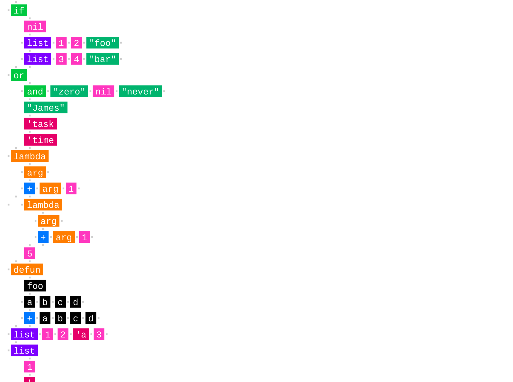
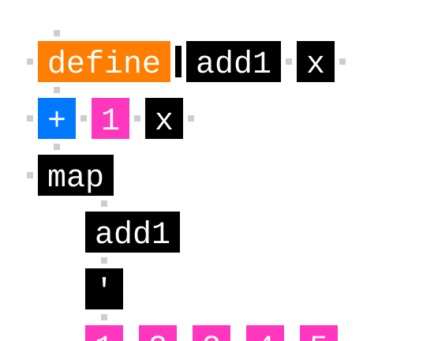
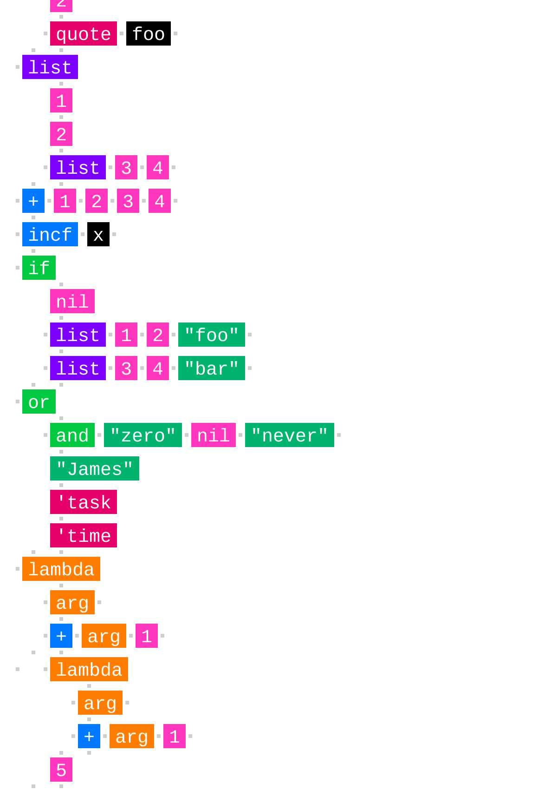
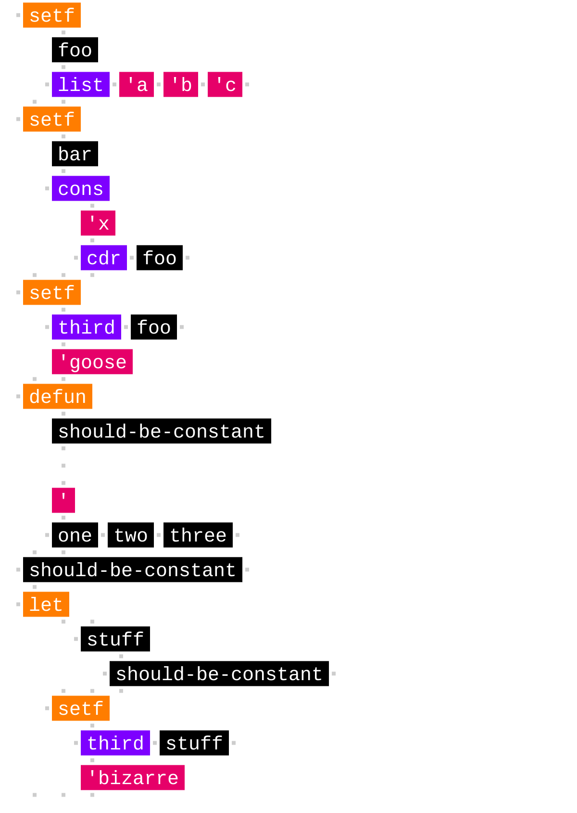
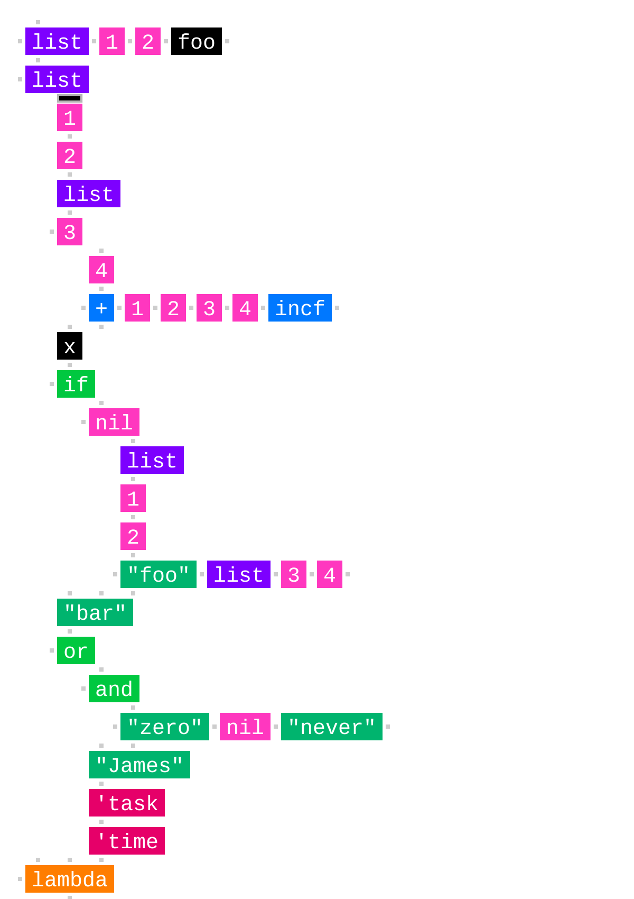

# Structure Editor

A prototype editor for Scheme that edits the structure of the code, rather than text.

Besides making it impossible to forget parethesis and mis-indent your code, this new breed of tree-based, or structure editors are loaded with unforeseen advantages.

When programmers actually edit their code, they’re not just typing and deleting characters. They’re trying to match up a rich, hierarchical, interconnected, underlying model in their head with an intermediate text form in front of them, which eventually gets translated back into something akin to the cognitive model. Unfortunately, the use of text is a vestige of typewriters and punchcards. Higher order structures suddenly become delicate, fragile, and brittle, when converted to and from text -- as any novice programmer will recount how many errors they’ve received from a compiler about a forgotten semicolon or bracket.

Instead of working with text as an immediate form, a structure editor operates directly on the tree form of code, mitigating if not completely bypassing the notion of "syntax errors". However this requires learning a new set of editing commands and operations, at the expense of leaving the comfortable textual model behind.

[Try in Browser](https://willy-vvu.github.io/StructureEditor/)

[Read the Blog Post](https://willy-vvu.github.io/hidden-bits/2016/12/18/a-better-editor.html)

---

Learning Focus: Editor Building, Visual Programming, Spatial Debugging, 2D Animation

Media: Code Editor, Interactive, Website

Software: JavaScript, p5.js

Date: December 2016
